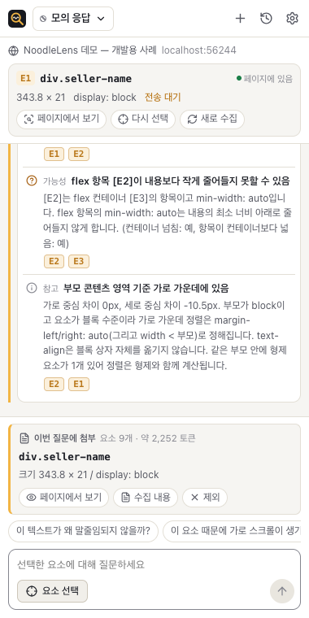
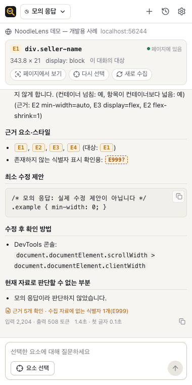
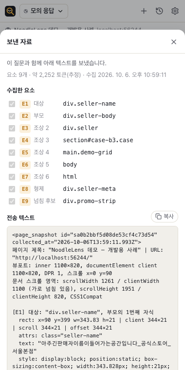

# NoodleLens

웹페이지에서 요소를 골라 레이아웃·스타일 문제를 묻는 Chrome 사이드 패널 확장 프로그램입니다.
스크린샷만 보고 추측하지 않고, 선택한 요소의 **DOM 일부, 실제 적용된 스타일(computed style), 크기 측정값**을 근거로
GPT 또는 Claude가 원인과 최소 수정안, 확인 방법을 설명합니다. 답변의 근거(`E3` 같은 식별자)를 누르면 페이지에서 그 요소가 강조됩니다.

| 요소 선택 | 근거가 붙은 답변 | 보낼 자료 미리보기 |
|---|---|---|
|  |  |  |

> 위 답변 화면은 개발용 **모의 응답**입니다. 실제 모델 답변 화면이 아닙니다.

## 무엇을 할 수 있나요
- **요소 선택**: 툴바 아이콘으로 패널을 열고 '요소 선택'을 누른 뒤 페이지에서 요소를 클릭합니다. hover 강조, `↑` 부모 선택, `Esc` 취소. 선택하는 동안 링크·버튼은 반응하지 않습니다.
- **근거 수집**: 대상과 조상·자식·형제 요소, 페이지 가로 넘침을 만드는 후보 요소까지 상한을 두고 수집합니다. 입력값·비밀번호·편집 중인 글은 수집하지 않습니다.
- **기본 검사**: 모델에 묻기 전에 측정값으로 확인할 수 있는 것을 코드로 계산합니다(가로 넘침, 말줄임 조건, flex/grid `min-width: auto`, 정렬 축, 이미지 크기).
- **질문과 답변**: GPT 또는 Claude를 골라 스트리밍으로 답을 받습니다. 답변은 관찰된 사실 / 가능성이 높은 원인 / 근거 / 최소 수정 / 확인 방법 / 판단할 수 없는 부분으로 나뉩니다. 숫자로 된 신뢰도는 만들지 않습니다.
- **근거 확인**: 답변 속 `E번호`가 실제 수집 자료에 있는지 검사하고, 누르면 페이지에서 강조합니다. 요소가 사라졌거나 페이지가 바뀌었으면 그렇다고 알려 줍니다.
- **보낼 자료 확인**: 질문 전에 모델에 보낼 텍스트를 그대로 보고 글·속성·주소·제목·요소를 뺄 수 있습니다.
- **대화 관리**: 중단, 명시적 재시도, 기록·검색·삭제. 패널을 닫았다 열어도 대화가 남고, 생성 중에 닫혔다면 받은 부분까지 '연결 끊김'으로 남습니다.

처음 다루는 문제 유형은 **가로 넘침과 불필요한 스크롤, 텍스트 말줄임 실패, Flex/Grid 정렬·크기 문제**입니다.

## 빠르게 시작하기

준비: Node.js 20.19 이상, Chrome 141 이상, OpenAI 또는 Anthropic **API 키**(ChatGPT·Claude 구독과 별도로 결제됩니다).

```bash
npm install
```

```bash
npm run build
```

1. Chrome에서 `chrome://extensions`를 열고 **개발자 모드**를 켭니다.
2. **압축해제된 확장 프로그램을 로드합니다**를 눌러 `dist/` 폴더를 고릅니다.
3. 살펴볼 페이지에서 툴바의 NoodleLens 아이콘을 누르면 사이드 패널이 열립니다(아이콘을 누른 탭에 접근 권한이 생깁니다).
4. 첫 화면의 데이터 처리 안내를 확인하고 동의합니다.
5. 설정(톱니바퀴)에서 API 키를 저장합니다. '이 기기에 저장(암호화)' 또는 '브라우저를 닫을 때까지만'을 고를 수 있습니다.

연습용 데모 페이지(원인을 알고 있는 사례 모음):

```bash
npm run demo
```

`http://localhost:4319/`(개발용 사례)와 `http://localhost:4319/eval.html`(평가용 사례)을 엽니다.

## 사용 방법
1. 아이콘을 눌러 패널을 열고 상단에서 모델을 고릅니다. 대화마다 제공자(GPT/Claude)가 고정되며, 다른 제공자를 고르면 새 분석으로 시작합니다.
2. **요소 선택** → 페이지에서 요소 클릭. 대상 카드, 첨부 카드, 기본 검사가 나타납니다.
3. 질문합니다. 예: "이 텍스트가 왜 말줄임되지 않을까?", "이 요소 때문에 가로 스크롤이 생기는 걸까?"
4. 답변의 `E번호`를 눌러 페이지에서 근거 요소를 확인합니다. 페이지를 바꿨다면 '새로 수집'으로 다시 잰 뒤 이어서 질문합니다.

다른 탭으로 옮겨 선택하려면 그 탭에서 아이콘을 한 번 누르거나, 설정에서 '모든 사이트에서 바로 선택'을 켭니다.

## 권한과 데이터
- 기본 권한은 `activeTab`(아이콘을 누른 탭에만), `scripting`, `sidePanel`, `storage`, 그리고 두 API 호스트(`api.openai.com`, `api.anthropic.com`)입니다. 모든 사이트 접근은 선택 권한입니다.
- 질문을 보낼 때만 질문과 수집 자료가 사용자가 고른 제공자에게 사용자의 키로 전송됩니다. 개발자 서버는 없습니다.
- 대화·수집 자료는 이 브라우저의 확장 프로그램 저장소에만 있고 언제든 지울 수 있습니다. 대화를 지우면 그 대화의 수집 자료도 함께 지워집니다.

자세한 내용: [docs/PRIVACY.md](docs/PRIVACY.md)

## 한계
- computed style만으로는 원본 CSS 파일·줄 번호·어느 규칙이 적용됐는지 알 수 없습니다. DOM만으로는 React 컴포넌트 이름·props·state를 알 수 없습니다.
- closed shadow root 내부와 iframe 내부 문서는 수집하지 않습니다. Chrome 내부 페이지·웹 스토어에서는 동작하지 않습니다.
- 스크린샷 첨부, CSS 수정 미리보기, 수정 전후 재측정은 아직 없습니다.

자세한 내용: [docs/DESIGN.md](docs/DESIGN.md#13-알려진-기술적-한계)

## 검증 상태
단위 테스트 69개, 실제 사이드 패널 E2E 39개가 통과했습니다. 실제 서버에 무효한 키로 요청해 두 제공자의 401 처리를 확인했습니다.
**유효한 키로 실제 모델 답변을 받은 검증과 모델 답변 품질 평가는 아직 하지 않았습니다.** 결과와 미확인 항목: [docs/EVALUATION.md](docs/EVALUATION.md)

## 개발

| 명령 | 설명 |
|---|---|
| `npm run build` | 배포용 빌드(`dist/`) |
| `npm run build:dev` | 개발 빌드(`dist-dev/`, 모의 제공자 표시) |
| `npm run watch` | 개발 빌드 감시 |
| `npm run typecheck` | 타입 검사 |
| `npm test` | 단위 테스트 |
| `npm run test:e2e` | 개발 빌드 후 실제 사이드 패널 E2E(Playwright 번들 Chromium 필요) |
| `npm run demo` | 데모 페이지 서버 |
| `npm run eval -- --provider anthropic --set all` | 모델 평가(`.env.local`의 키 사용) |
| `npm run eval:check` | 평가 도구 자체 점검(모델 호출 없음) |

E2E에는 Playwright가 내려받는 Chrome for Testing이 필요합니다(`npx playwright-core install chromium`). 브랜드 Chrome은 명령행으로 확장 프로그램을 불러올 수 없습니다.

실제 사이트 E2E는 네트워크가 필요해 기본 실행에서 빠져 있습니다.

```bash
NL_REAL_SITES=1 npx vitest run -c vitest.e2e.config.ts tests/e2e/real-sites.e2e.ts
```

## 문서
- [docs/PLAN.md](docs/PLAN.md) — 단계별 계획, MVP 범위와 제외 범위, 후속 우선순위
- [docs/CONNECTION.md](docs/CONNECTION.md) — 모델 연결 방식 비교와 확정 사항(출처 포함)
- [docs/DESIGN.md](docs/DESIGN.md) — 주요 설계 결정
- [docs/PRIVACY.md](docs/PRIVACY.md) — 권한과 데이터 처리
- [docs/EVALUATION.md](docs/EVALUATION.md) — 검증 결과와 미확인 항목

## 라이선스
MIT
